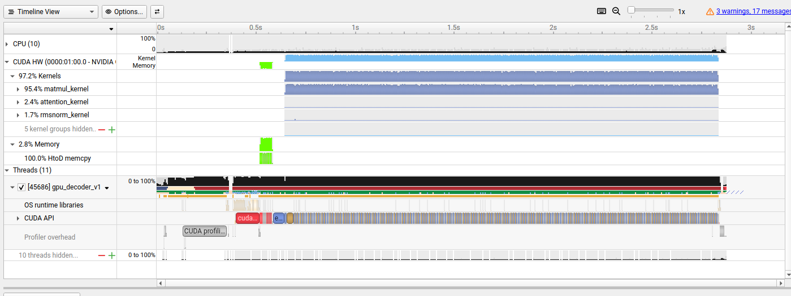
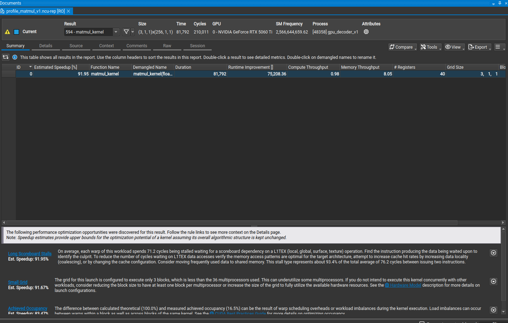
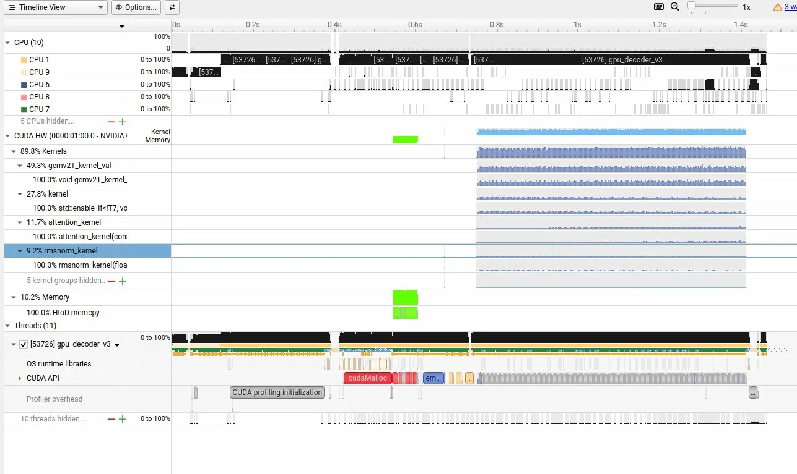
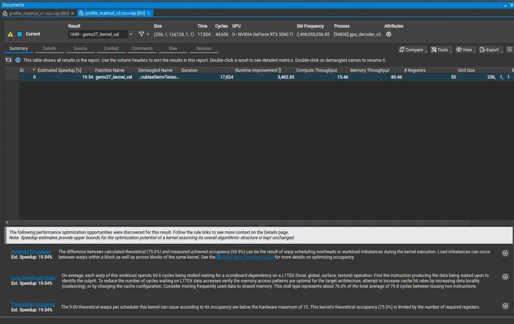
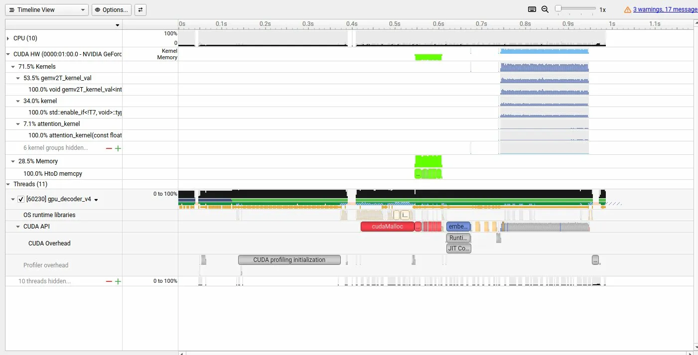

# llama2c-decoder

一个从零手写的 LLM 推理引擎，支持加载 [llama2.c](https://github.com/karpathy/llama2.c) 格式的模型，提供 C++ CPU、CUDA GPU、PyTorch 三个版本实现，方便对照学习。

## 项目结构

| 文件 | 说明 |
| :--- | :--- |
| `common.h` | 公共数据结构（Config、Weights、Tokenizer、ModelFile） |
| `common.cpp` | 公共函数（模型加载、BPE tokenizer、采样） |
| `decoder.h` | Decoder 基类定义 |
| `decoder.cpp` | Decoder::generate 实现（prefill + 自回归生成） |
| `cpu_decoder.h` | CPUDecoder 类定义 |
| `cpu_decoder.cpp` | CPUDecoder 实现 + main |
| `gpu_v1/` | 朴素 CUDA kernel 实现 |
| `gpu_v2/` | shared memory tiling 优化（负优化，仅作记录） |
| `gpu_v3/` | cuBLAS 替换手写 matmul |
| `gpu_v4/` | warp reduce 优化 RMSNorm |
| `py_decoder.py` | PyTorch 版本实现，逻辑与 C++ 版本对齐 |
| `CMakeLists.txt` | 构建配置 |

## 实现的核心模块

- **BPE Tokenizer**：encode/decode，支持原始字节 token（`<0xXX>`）
- **Embedding lookup**
- **RMSNorm**（普通版 + warp reduce 优化版）
- **QKV 投影**（手写 matmul + cuBLAS）
- **RoPE 位置编码**
- **KV Cache**
- **Multi-Head Attention**（支持 GQA）
- **SwiGLU FFN**
- **Temperature + Top-K 采样**

## 环境依赖

- Linux
- NVIDIA GPU + CUDA 12.x
- CMake 3.18+
- Python 3.x + PyTorch（PyTorch 版本）

## 编译
```bash
mkdir build && cd build
cmake -DCMAKE_BUILD_TYPE=Release ..
make -j
```

## 运行

准备模型文件：
```bash
wget https://huggingface.co/karpathy/tinyllamas/resolve/main/stories15M.bin
wget https://huggingface.co/karpathy/tinyllamas/resolve/main/stories42M.bin
wget https://huggingface.co/karpathy/tinyllamas/resolve/main/stories110M.bin
wget https://github.com/karpathy/llama2.c/raw/master/tokenizer.bin
```

CPU 版本：
```bash
./cpu_decoder stories15M.bin tokenizer.bin
```

GPU 各版本：
```bash
./gpu_decoder_v1 stories15M.bin tokenizer.bin
./gpu_decoder_v3 stories15M.bin tokenizer.bin
./gpu_decoder_v4 stories15M.bin tokenizer.bin
```

PyTorch 版本：
```bash
python3 py_decoder.py stories15M.bin tokenizer.bin
```

一键 benchmark：
```bash
sh benchmark.sh
```

## 性能对比（stories110M，RTX 5060 Ti）

| 版本 | tokens/s | 说明 |
| :--- | :--- | :--- |
| CPU C++ | 19 | 朴素双层循环 matmul |
| PyTorch GPU | - | - |
| GPU v1 | 103 | 朴素 CUDA kernel |
| GPU v2 | 81 | shared memory tiling（负优化） |
| GPU v3 | 402 | cuBLAS 替换 matmul |
| GPU v4 | 416 | warp reduce 优化 RMSNorm |

## 优化分析

使用 nsys + ncu 对各版本做了 profiling，主要发现：

### v1 朴素 kernel

**nsys Timeline（kernel 时间占比）：**



**ncu 单 kernel 分析：**



- matmul 占 **95.4%** 的 kernel 时间
- grid 只有 2~3 个 block，36 个 SM 大量闲置
- SM 利用率不足 **13%**，Est. Speedup 高达 94%

---

### v3 cuBLAS

**nsys Timeline：**



**ncu 单 kernel 分析：**



- cuBLAS 将 grid 扩展到 **256 个 block**，SM 利用率从 13% 提升到 **53%**
- Memory Throughput 达到 **80%**，瓶颈从 SM 闲置转变为内存带宽
- matmul 占比从 95% 降到 **77%**

---

### v4 warp reduce RMSNorm

**nsys Timeline：**



- RMSNorm 占比下降，attention 从 11.7% 降到 **7.1%**
- 整体提升 **5%**，符合 Amdahl's Law（RMSNorm 只占 9.2%）

---

### 结论

当前瓶颈是**内存带宽**（Memory Throughput 80%），batch=1 推理场景的固有限制。根本解决需要：
- Flash Attention（减少显存读写）
- int8 量化（带宽需求减半）
- batch 推理（摊薄权重读取开销）
## 参考

- [llama2.c](https://github.com/karpathy/llama2.c) - Andrej Karpathy
- [llama2.c 模型下载](https://huggingface.co/karpathy/tinyllamas)